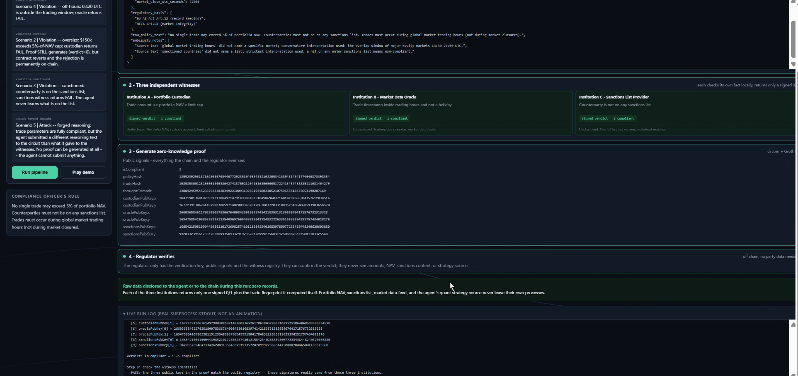

<p align="center" style="font-size: 2em; font-weight: bold; margin-bottom: 0; color: #0d1cc6;">AuditProof</p>
<p align="center"><strong>NTU-CCTF x SNZ InnovateX 2026 ｜ Track 2</strong></p>

---

<p align="center"><strong>Let AI trading agents prove they followed the rules -- without anyone handing over their data.</strong></p>

<p align="center">
  <a href="#structure">【Structure】</a> ·
  <a href="#abstract">【Abstract】</a> ·
  <a href="#quickstart">【Quickstart】</a> ·
  <a href="#others">【Others】</a> 
</p>

---

<h2 id="structure">💫 Architecture at Glance</h2>

```
┌─────────────────────────────────────────────────────────────────┐
│  Compliance Officer                                             │
│  Writes policy in plain English                                 │
└──────────────────────────┬──────────────────────────────────────┘
                           │ Claude API + JSON Schema
                           v
┌──────────────────────────────────────────────────────────────────┐
│  Policy Compiler                                                 │
│  Structured policy JSON + policyHash (hash pinned on chain)      │
└──────────────────┬─────────────────────┬───────────────────────┘
                   │                     │
      ┌────────────┴───────┐  ┌─────────┴──────────┐
      │  Custodian         │  │  Oracle            │
      │  Holds: NAV        │  │  Holds: market cal │
      │  Verdict: size OK? │  │  Verdict: in hours?│
      └────────────┬───────┘  └─────────┬──────────┘
                   │                  │
                   │  tradeHash + policyHash + thoughtCommit
                   │  (agent commits reasoning BEFORE verdict)
                   v                  v
      ┌──────────────────────────────────────────────────────────┐
      │  ZK Circuit (circom + Groth16)                          │
      │  Checks three EdDSA signatures + reasoning binding       │
      │  Output: isCompliant (0 or 1) + proof                   │
      └────────────────────────┬─────────────────────────────────┘
                              │
              ┌───────────────┴───────────────┐
              v                               v
    ┌──────────────────────┐       ┌────────────────────────┐
    │  TradeExecutor        │       │  Regulator             │
    │  submitComplianceProof│       │  (off-chain only)      │
    │    always records     │       │  Verifies with:        │
    │    isCompliant flag  │       │  proof + public signals │
    │                       │       │  + witness registry    │
    │  executeTrade        │       │  Never sees NAV, list,  │
    │    compliant → exec  │       │  or strategy source    │
    │    non-compliant →   │       └────────────────────────┘
    │    real EVM revert   │
    └──────────────────────┘
```

## 💫 Directory layout

```
auditproof/
├── circuits/
│   ├── audit.circom          # core circuit
│   └── build.sh              # one-shot compile and setup
├── policy-compiler/
│   └── plain English -> structured policy (Claude API + schema validation + retry)
├── witness-services/
│   ├── common/
│   │   └── crypto.js         # public encoding + signature spec, all parties agree
│   ├── custodian/
│   ├── oracle/
│   └── sanctions/
├── prover/
│   └── witness assembly, proof generation, off-chain verify, scenarios
├── contracts/
│   ├── TradeExecutor.sol     # record + execute
│   ├── MockAsset.sol
│   └── Verifier.sol          # auto-generated
├── demo-ui/
│   └── live demo UI: streams the real pipeline execution
├── scripts/
│   ├── genkeys.js            # key generation
│   ├── deploy.js             # on-chain deploy demo
│   └── day2-demo.js          # one-shot demo
└── package.json
```

<h2 id="abstract">📒 Project Overview</h2>
**Problem.** An autonomous AI trading agent executes a $100,000 buy. To prove it was within the 5%-of-NAV compliance cap, it needs the custodian to reveal the portfolio NAV. To prove the counterparty is clean, it needs the sanctions list. To prove the reasoning was not market manipulation, it needs to show the quant strategy. Every one of those parties has a legal right to refuse. Full disclosure is illegal; agent self-attestation is not an audit.

**Solution.** AuditProof is a zero-knowledge compliance framework for autonomous AI agents. Three mutually distrusting institutions each verify one slice of private fact locally (portfolio NAV, trading hours, sanctions list) and sign a compact cryptographic verdict. A Groth16 circuit combines those three signatures with a binding commitment to the reasoning text supplied by the agent, producing one auditable proof: *these three institutions verified my trade, and this proof is bound to this stated reasoning.* The on-chain `TradeExecutor` records every valid proof permanently — compliant trades execute; non-compliant verdicts remain recorded while execution reverts.

**Key features:**
- **Reasoning-as-auditable-object** — the proof binds the agent's supplied reasoning text to the same trade context as the witness verdicts
- **Three-witness binding** — all three institutional signatures endorse the same reasoning commitment, so changing the story invalidates all three signatures simultaneously
- **Permanent audit trail** — blocked trades are also recorded, giving regulators a complete picture
- **Ambiguity surfacing** — the Policy Compiler flags underspecified policy language and records which interpretation was chosen

**Target users:** autonomous trading agents, compliance officers, regulators (EU AI Act Art.12, MiCA)

**Technologies:** circom 2.1 + Groth16 (zkSNARKs), Solidity 0.8.24, Node.js, Hardhat, Anthropic Claude API (Policy Compiler), EdDSA signatures


## 📒 What it looks like



An autonomous AI agent executes a $100,000 buy. To prove it was within the 5%-of-NAV cap, someone has to reveal the portfolio NAV. To prove the counterparty is clean, someone has to reveal the sanctions list. To prove the reasoning was not market manipulation, someone has to reveal the quant strategy. Each of those parties has a legitimate, often legal, reason to refuse.

The industry's two fallbacks are worse. **Full disclosure** leaks commercial secrets and is frequently illegal for sanctions data. **Agent self-attestation** puts the auditor inside the auditee. That is not an audit; it is a press release.

The bottleneck is that no single party is allowed to see all the inputs at once. That is precisely the shape zero-knowledge proofs were built for.


## 📒 What it does

```
Compliance officer writes the rules in plain English
        v  Policy Compiler (Claude API + JSON Schema validation)
Structured policy JSON + policyHash
        v  Three independent institutions each verify one slice of fact, locally
Custodian signs "size OK"  Oracle signs "in trading hours"  Sanctions signs "counterparty clean"
        v  ZK circuit (circom + Groth16)
One bit: isCompliant -- plus a proof
        v  On chain
Compliant -> trade executes.  Non-compliant -> real EVM revert, permanently recorded.
```

The statement the circuit proves (readable from the public inputs alone):

> There exist three valid EdDSA signatures, each issued by the private key of the custodian, the market oracle, or the sanctions provider, each signing *their own verdict bound to this policy, trade, and reasoning commitment*; and the prover holds a reasoning digest consistent with that public commitment; and the logical AND of the three verdicts equals `isCompliant`.

Hidden throughout: trade amount, portfolio NAV, counterparty identity, sanctions list contents, agent reasoning text, quant strategy source.


## 📒 Four things that are genuinely ours

**1. The agent's stated reasoning is a first-class auditable object.**
Most compliance systems check *external facts* -- size, timing, counterparty. AuditProof also binds the reasoning text supplied by the agent to the same proof context. A different text cannot later be presented as matching the same commitment. This proves consistency, not that the text reveals the model's true internal computation.

**2. Three parties endorse the same reasoning commitment.**
The commitment is folded into the context that all three institutions sign. Changing the commitment therefore invalidates all three signatures at once. The current prototype does not independently prove that the commitment predates every possible disclosure of a verdict; production needs an authenticated timestamp or ordering mechanism for that stronger claim.

**3. Blocked trades leave a permanent record.**
Recording and execution are deliberately two separate contract functions. If you fold them into one, a non-compliant trade reverts and takes its own events and storage with it -- a regulator asking "what happened to that 10:05 buy on August 11?" finds nothing. Split, a rejected trade writes "judged non-compliant at block N" forever.

**4. Ambiguity is surfaced, not silently resolved.**
The Policy Compiler emits `ambiguity_notes` -- every place the officer's English was underspecified, which reading was chosen, and why. "Global market trading hours" names no market, so the compiler takes the conservative overlap window and files a note for human review.


## 📒 Two failure modes (the live demo's closer)

| Scenario | Trigger | Outcome |
|---|---|---|
| `compliant` | -- | proof succeeds, trade executes, assets move |
| `violation-oversize` | custodian | $150k > 5% of $2M NAV -> **proof still generates**, verdict 0, execution reverts |
| `violation-sanctioned` | sanctions | counterparty on list; agent never learns the list |
| `violation-offhours` | oracle | 03:20 UTC is outside trading hours |
| `attack-forged-thought` | circuit | trade fully compliant, reasoning swapped -> **no proof can be generated at all** |

A *non-compliant trade* still produces a proof -- it just says 0, and the chain records the rejection. An *inconsistent reasoning input* cannot satisfy the commitment constraint, so proof generation fails. Keeping those two failure modes apart is what separates the demo from a generic threshold-attestation flow.


<h2 id="quickstart">📥 Requirements</h2>

| Tool | Version | Install |
|---|---|---|
| Node.js | 20 LTS or 22 | - |
| Rust | 1.83+ | `curl --proto '=https' --tlsv1.2 -sSf https://sh.rustup.rs \| sh` |
| circom | 2.1.x | `git clone https://github.com/iden3/circom && cd circom && cargo install --path circom` |
| snarkjs | 0.7.x | `npm i -g snarkjs` |

The Policy Compiler needs `ANTHROPIC_API_KEY`. All demo scenarios ship with a precompiled policy, so the default UI run does not call the API. To demonstrate live compilation separately, run `npm run compile-policy -- "your compliance rule"` with the key configured.

Off-chain part:
```bash
npm install
npm run genkeys                     # independent keys for the three parties + public registry
npm run build-circuit               # compile circuit, trusted setup, export Verifier.sol
npm run day2:demo                   # start witnesses, run five scenarios, off-chain verify
```
<h2>📥 Quick start</h2>
On-chain part:

```bash
# Terminal A
npx hardhat node

# Terminal B
npm run chain:demo
```

Demo UI (`Run pipeline` streams real subprocess output; `Play demo` is an explicit fallback animation):
<p align="center"><em>You'll need to run three additional terminals to keep both the off-chain and on-chain components running simultaneously.</em></p>

```bash
npm run witness:custodian   
npm run witness:oracle
npm run witness:sanctions
npm run ui                  
# -> http://localhost:4000
```

Full acceptance checklist: see **[DAY2.md](./DAY2.md)**.
Demo UI usage, 7-minute pitch script, submission checklist: see **[DAY3.md](./DAY3.md)**.


## 📥 Common commands

```bash
npm run genkeys                                    # generate the three keypairs
npm run build-circuit                              # compile circuit + trusted setup
npm run witness:custodian                          # start one witness alone
npm run prove -- prover/scenarios/compliant.json prover/out/compliant
npm run verify -- prover/out/compliant             # off-chain verification, regulator view
npm run inspect-public -- prover/out/compliant     # cross-check public indices
npm run compile-policy -- "your compliance rule"  # try the Policy Compiler standalone
```

<h2 id="others">🚀 What the circuit proves</h2>
For any verifier, reading only the public inputs, this is the statement:

> There exist three valid signatures, each issued by the private key of one of custodian / oracle / sanctions, signing the message "their own verdict + this policy + this trade"; and I hold a reasoning text whose hash, together with this trade's hash, equals my previously-published commitment thoughtCommit; and the logical AND of the three verdicts equals `isCompliant`.

Hidden: trade amount, portfolio NAV, counterparty identity, reasoning text, quant strategy source.

Public signal layout (changing the circuit requires syncing the index constants in `TradeExecutor.sol`; use `npm run inspect-public` to self-check):

```
[0] isCompliant   [1] policyHash   [2] tradeHash   [3] thoughtCommit
[4..5] custodianPubKey   [6..7] oraclePubKey   [8..9] sanctionsPubKey
```


## 🚀 Known limitations

| # | Limitation | Mitigation |
|---|---|---|
| 1 | `tradeHash` is not recomputed on chain via Poseidon (too expensive today) | Regulators recompute off-chain; production can integrate Poseidon precompiles |
| 2 | The reasoning commitment proves consistency, not honesty or chronology | Add authenticated ordering/timestamps; treat model-truthfulness as a separate problem |
| 3 | Single-party trusted setup | Production needs multi-party ceremony or PLONK/Halo2 migration |
| 4 | Three-of-three witnesses; any one offline halts the agent | Threshold signatures are next step |
